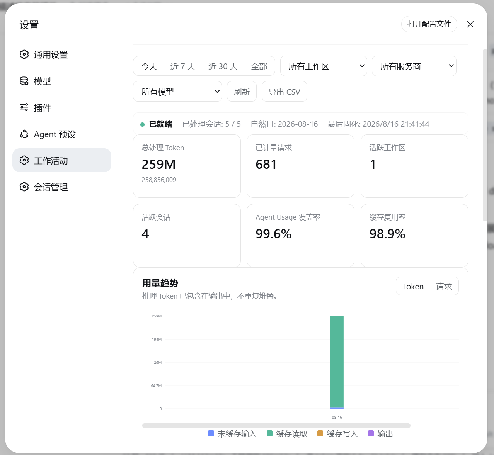
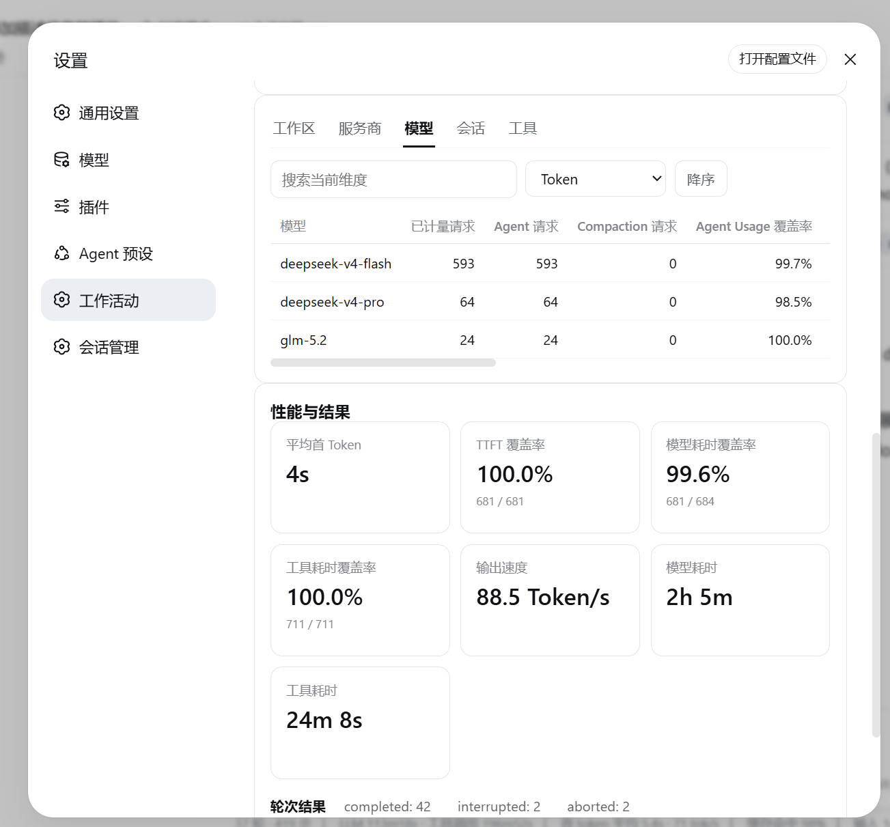

# dsh-activity-report

DeepSeek Harness Web GUI 的「工作活动」统计面板：以 **服务商（provider）/ 模型（model）/ 会话（session）** 三个维度，统计本地全部会话的活动与用量数据（请求数、Token 四类、轮次、工具调用、耗时、结束原因）数据仅保存在本机。





## 安装

```sh
dsh plugin --profile web add dsh-activity-report@0.1.0-alpha.0
```

安装后**重启 `dsh web`** 生效（host 半部分需要重启加载；client bundle 随页面刷新加载）。

打开 **设置 > 工作活动** 查看。

## 功能

- **三个维度 Tab**：按服务商 / 按模型 / 按会话（会话维度显示标题 + 工作区，可点击打开）
- **时间范围**：今天 / 近 7 天 / 近 30 天 / 全部
- **汇总卡片**：总 Token、请求数、轮次、总耗时、工具调用、工具失败，以及结束原因分布
- **趋势图**：按天的 Token 用量（零依赖 SVG 柱状图）
- **明细表**：每个分组的请求数 / 输入 / 输出 / 缓存命中 / 缓存写入 / 总 Token / 轮次 / 工具调用 / 耗时，按总 Token 降序
- **工具调用明细**：全部工具名 × 次数 chips


